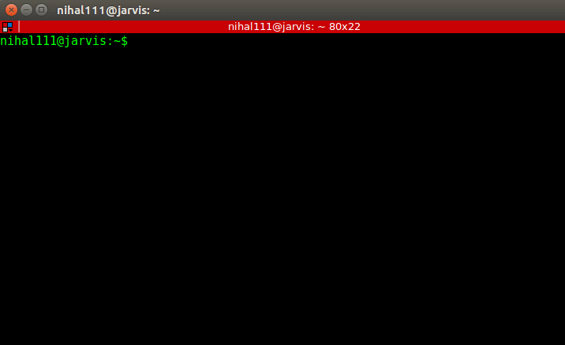
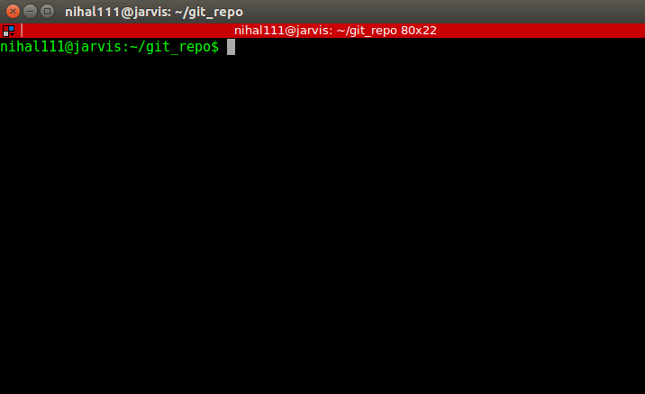
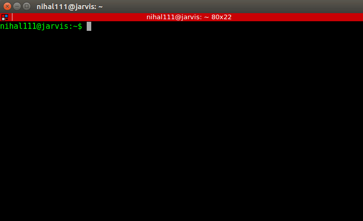

# bashortcuts

Turn on bash shortcuts using key-bindings and macros to supercharge your bash productivity.

'bashortcuts' or bash-shortcuts is a skinny python script that helps build a personalized inputrc, which is a customized configuration of GNU Readline, the input related library used by bash and most other shells. Additionally, it makes it easy to define macros that can be used to tie shell_commands and functions to key sequences.

For starters, each key press is handled by a binding in bash. These bindings can be viewed using `bind -P`. So when you press the `UP` arrow to go to the previous command you executed, it is translated into a character sequence of "[A" and is handled by the binding `"\e[A": previous-history"`. This binding maps the key-sequence `\e[A` with the readline function `previous-history`. bashortcuts leverages these readline functions in addition to custom defined functions, and allows mapping them to key combinations easily.

## Current Features
### Readline Functions
#### Auto-complete from history
Search through your history by partially typing a command. Hit `CTRL`+`UP` and `CTRL`+`DN` to cycle through auto-complete options from history. (startswith)


#### Cycle through usage in history
Hit `SHIFT`+`UP` and `SHIFT`+`DN` to cycle through all usages of a phrase from history. (contains)



#### Tabbing
Auto-complete when ambiguous: 
- First `TAB` press yields the list of ambiguous matched (default behavior).
- Subsequent `TAB` and `SHIFT`+`TAB` presses cycle through all the possible completions.



#### Deletion
- `ALT`+`BACKSPACE` to delete word before cursor
- `ALT`+`DEL` to delete word after cursor.


### Custom Functions
#### History Search
List history usage. Use `CTRL` + `H` while typing a command to view all past usages from history.d



#### Git Shorthands
Git shortcuts with key bindings.
- `CTRL` + `G` + `A` to get `git add `
- `CTRL` + `G` + `O` to get `git checkout `
- `CTRL` + `G` + `B` to get `git branch `
- `CTRL` + `G` + `P` + `O` to get `git push origin `


## How to use:
1. Clone the repository: `git clone https://github.com/nihal111/bashortcuts/`
2. Run the setup script.
```
cd bashortcuts
python setup.py
```
3. The setup would proceed to take a backup of the files it modifies and saves it, by default, inside `bashortcuts/backups/BACKUP_<DATE>`. You can change the name of the folder, when asked.
4. The setup proceeds to make changes to .bashrc, .inputrc and creates a .bash_bindings file from the `inputrc_config` and `bash_bindings_config` files in the bashortcuts directory.
5. After the setup completes, restart the terminal to make the changes take effect.

The `inputrc_config` and `bash_bindings_config` files can be edited and `setup.py` re-run to update the settings.

#### inputrc_config
This is (presently) a mirror of the `~.inputrc` file that will be created/updated. This is used to assign key sequences to readline functions, and set readline variables. It has a few settings defined and a few commented, for you to play around with.

#### bash_bindings_config
This is (presently) a mirror of the `~.bash_bindings` file that will be created. This is used to bind keysequences to shell_commands and custom functions.

## Additional info:

#### inputrc loading
Global values are set in /etc/inputrc. Personal (local) user values are set in ~/.inputrc.

The settings in ~/.inputrc file will override the global settings file. Bash uses /etc/inputrc if there is no .inputrc for a user when /etc/profile is read (usually at login). [Ref](http://www.softpanorama.org/Scripting/Shellorama/Bash_as_command_interpreter/inputrc.shtml)

#### Character Sequence for key press
The character sequence `\e[1;5A` maps to `Ctrl` + `UP` key combination.
These are ANSI control-code escape sequences that are transmitted when various non alphanumeric keys are pressed on a "terminal" keyboard. You can determine the character sequence emitted by a key by-
1. Pressing Ctrl-v at the command line, then pressing the key you're interested in. [Ref](https://stackoverflow.com/questions/4200800/in-bash-how-do-i-bind-a-function-key-to-a-command)
2. Run `sed -n l` and type the key combo followed by Enter on the keyboard. [Ref](https://unix.stackexchange.com/questions/76566/where-do-i-find-a-list-of-terminal-key-codes-to-remap-shortcuts-in-bash)
3. Run `showkey -a` and type in the key combinations.


#### bind
Man page [here](https://ss64.com/bash/bind.html). Bash bind reference [here](https://www.gnu.org/software/bash/manual/bashref.html#Bash-Builtins)
`bind -P`: Lists current readline function names and bindings in a user friendly fashion.
`bind -p`: Display readline function names and bindings in such a way that they can be re-read, like `bind -p > inputrc`
`bind -l`: Displays the list of all readline funcitons.
`bind -x`: Bash-2.04 introduced option -x to bind key sequences to shell commands. Also allows binding a macro to a key sequence.

#### readline
Readline offers a raft of functions. The [Bash reference at gnu.org](https://www.gnu.org/software/bash/manual/bashref.html#Command-Line-Editing) offers a complete listing of escape sequences and Readline functions.
